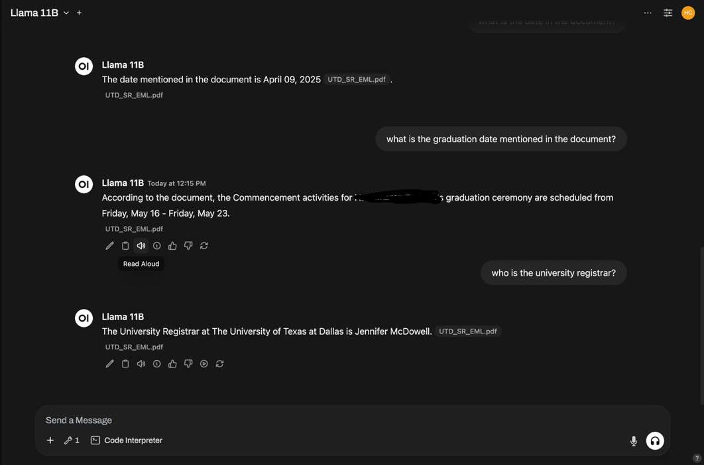

# SecureEdgeAI: Local AI Assistant

**A privacy-first, fully customizable Large Language Model (LLM) assistant that runs 100% offline.**

SecureEdgeAI solves the critical problem of **data privacy and security** for small businesses and independent professionals. By operating entirely on client-owned hardware, it provides the power of AI—such as summarization, contract review, and content generation—without the risk of exposing sensitive data to external cloud servers.

---

## 💡 Solution Overview

The Local AI Assistant is a managed-services solution that deploys a custom, turnkey LLM stack on-premises.

### Key Features
* **100% Offline Operation:** All processing happens locally on client hardware, ensuring **data sovereignty** and zero dependency on external APIs or the internet.
* **Hardware Efficient:** Utilizes **4-bit quantized models** to ensure functionality on systems with as little as 16 GB RAM.
* **Customizable Workflows:** Includes **fine-tuned prompt templates** and profiles for specific industry use cases (e.g., legal, education, creative, retail).
* **Open-Source Stack:** Built using reliable, open-source tools like **Open WebUI, Ollama, and LLaMA3/Qwen3**.
* **Secure & Contained:** Configuration enforces security measures like binding the WebUI only to `localhost` and using full-disk encryption to protect cached data.

---

## 🛠️ Technology Stack

The assistant is built on the following core components:

| Component | Role | Models |
| :--- | :--- | :--- |
| **Inference Engine** | **Ollama** | Optimized for lightweight CPU and GPU inference. |
| **Interface** | **Open WebUI** | Provides a user-friendly, interactive chat interface with access controls. |
| **LLMs** | **LLaMA3** and **Qwen3** | Used for generating content and processing requests. |
| **Quantization** | **4-bit and 8-bit** | Reduces memory usage to run large models on commodity hardware. |

### Example Model Configuration (From Pricing Tiers)
| Plan | LLaMA3 Model | Qwen3 Model |
| :--- | :--- | :--- |
| **Starter Plan** | Llama3-14B, 8-bit quantized | Qwen3-32B, 4-bit quantized |
| **Growth Plan** | Llama3-70B, 4-bit quantized | Qwen3-32B, 8-bit quantized + higher context |

---

## 🚀 Getting Started (Deployment)

Since the solution involves setting up a full local environment, we advise using a deployment script for efficiency.

### Prerequisites

You will need client hardware meeting at least the minimum **Starter Plan** specification:
* **CPU:** Ryzen 7 or equivalent
* **RAM:** 32 GB
* **Storage:** 1 TB SSD
* **Software:** Docker or Ansible installed for deployment automation scripts.

---

## 📂 Project Structure

This repository contains the following key directories:

| Directory | Purpose |
| :--- | :--- |
| **`docs/`** | Contains the full **Project Report** and **Presentation** for deeper context. |
| **`deployment/`** | Holds the necessary configuration and deployment scripts (Docker/Ansible) for replicating installations across client machines. |
| **`models/prompt_templates/`**| Example industry-specific files to showcase customization and LoRA fine-tuning for workflows. |
| **`src/data_scripts/`**| Python utility scripts for automation tasks like batch summarization or CSV analytics. |

## Demonstrated Use Cases
The assistant is shown performing several high-value tasks locally:
* **Revenue Analysis:** Generating a revenue breakdown from business data using LLaMA Vision.
  
* **Document Q&A (Local RAG):** Answering follow-up queries and extracting specific details (dates, names) from uploaded private documents.
  
* **Multi-modal Processing:** Analyzing an image (e.g., a food order table) and converting it into structured data.
  
* **Code Generation:** Generating functional Python scripts for automation.
  
* **Personalised Email Draft:** This demonstrates how the assistant can read an uploaded document and help you write a personalized email based on its content
  

---

---

## 🔗 Author
Reshmitha Marupaka  
Master's in Business Analytics and Artificial Intelligence, University of Texas at Dallas  
[LinkedIn](https://www.linkedin.com/in/reshmitham/) | GitHub: https://github.com/ReshmithaMarupaka24
